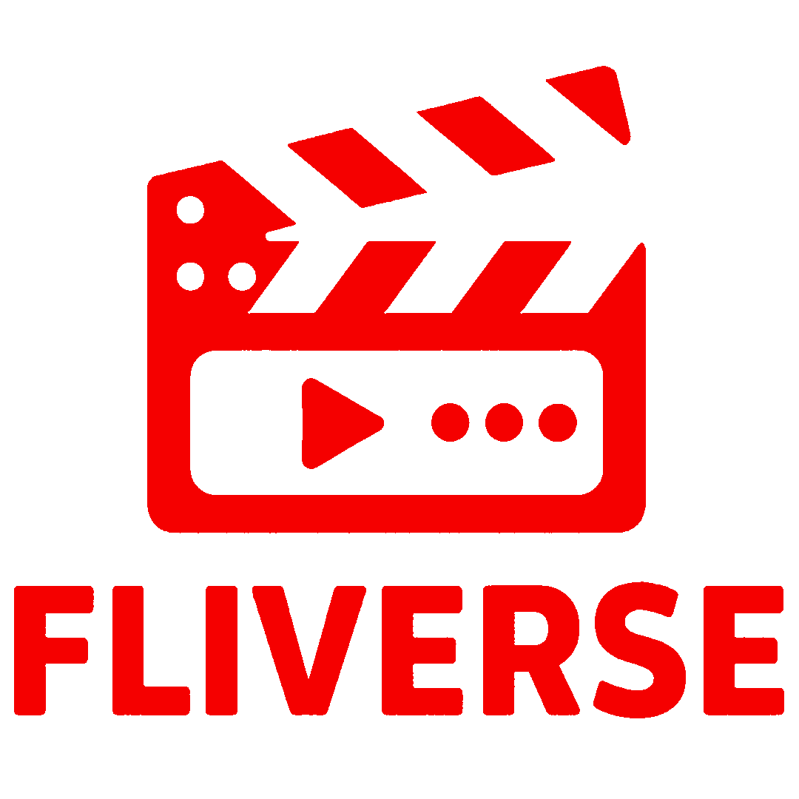

# 🎬 Fliverse - Frontend

<div align="center">
  
  
  **Una plataforma web comunitaria para descubrir y compartir información sobre películas y series**
  
  [](https://angular.io/)
  [](https://tailwindcss.com/)
  [](https://material.angular.dev/)

</div>

---

## 📋 Tabla de Contenidos

- [📖 Sobre el Proyecto](#-sobre-el-proyecto)
- [✨ Características](#-características)
- [🚀 Tecnologías](#-tecnologías)
- [⚡ Instalación y Configuración](#-instalación-y-configuración)
- [🎮 Uso](#-uso)
- [📁 Estructura del Proyecto](#-estructura-del-proyecto)
- [📄 Licencia](#-licencia)
- [👨‍💻 Autor](#-autor)

---

## 📖 Sobre el Proyecto

**Fliverse** es una aplicación web desarrollada como **Proyecto de Fin de Grado (TFG)** que funciona como una plataforma comunitaria para la gestión y descubrimiento de contenido audiovisual.

### 🎯 Objetivo Principal

Crear una experiencia de usuario moderna e intuitiva donde los usuarios puedan:
- 🔍 **Buscar** y descubrir películas y series
- 📝 **Contribuir** añadiendo nueva información
- 💬 **Interactuar** con la comunidad mediante comentarios
- 📋 **Organizar** su contenido en listas personalizadas
- 👤 **Gestionar** su perfil y preferencias

---

## ✨ Características

### 🌟 Funcionalidades Principales

- **🔐 Sistema de Autenticación**
  - Registro e inicio de sesión tradicional
  - Integración con Google OAuth
  - Gestión segura de sesiones

- **🎭 Gestión de Contenido**
  - Búsqueda avanzada de películas y series
  - Páginas detalladas con información completa
  - Reproductor de tráilers integrado con YouTube
  - Sistema de valoraciones y comentarios

- **📚 Listas Personalizadas**
  - Creación y gestión de listas personalizadas
  - Marcado de contenido como visto/por ver
  - Seguimiento del progreso de visualización

- **👥 Funciones Sociales**
  - Sistema de comentarios y valoraciones
  - Perfiles de usuario personalizables
  - Interacción comunitaria

### 🎨 Experiencia de Usuario

- **📱 Diseño Responsivo**: Optimizado para todos los dispositivos
- **🌙 Modo Oscuro**: Interfaz cómoda para cualquier momento del día  
- **⚡ Carga Rápida**: Optimizaciones de rendimiento y lazy loading
- **🎬 Animaciones Fluidas**: Transiciones suaves con GSAP
- **♿ Accesibilidad**: Cumple con estándares de accesibilidad web

---

## 🚀 Tecnologías

### 🏗️ Frontend Framework
- **[Angular 19.2.8](https://angular.io/)** - Framework principal
- **[TypeScript 5.5.2](https://www.typescriptlang.org/)** - Lenguaje de programación

### 🎨 UI/UX
- **[Angular Material](https://material.angular.dev/)** - Componentes UI
- **[Tailwind CSS 4.1.6](https://tailwindcss.com/)** - Framework de utilidades CSS
- **[GSAP](https://www.npmjs.com/package/gsap)** - Animaciones avanzadas

### 🔧 Utilidades y Servicios
- **[Axios](https://www.npmjs.com/package/axios)** - Cliente HTTP
- **[Moment.js](https://momentjs.com/)** - Manejo de fechas
- **[YouTube Player](https://www.npmjs.com/package/@angular/youtube-player)** - Reproductor de videos
- **[Vercel Analytics](https://vercel.com/analytics)** - Análisis de rendimiento

### 🛠️ Herramientas de Desarrollo
- **[Angular CLI](https://cli.angular.io/)** - Herramientas de desarrollo

---

## ⚡ Instalación y Configuración

### 📋 Prerrequisitos

Asegúrate de tener instalado:
- **Node.js** (versión 18 o superior)
- **npm** (viene con Node.js)
- **Angular CLI** (versión 19)

```bash
# Verificar versiones
node --version
npm --version

# Instalar Angular CLI globalmente (opcional)
npm install -g @angular/cli
```

### 🔧 Instalación

1. **Clonar el repositorio**
   ```bash
   git clone https://github.com/BetaGun03/fliverse-frontend.git
   cd fliverse-frontend
   ```

2. **Instalar dependencias**
   ```bash
   npm install
   ```

3. **Configurar variables de entorno** (si es necesario)
   ```bash
   # Crear archivo de configuración
   cp src/environments/environment.example.ts src/environments/environment.ts
   ```

4. **Iniciar el servidor de desarrollo**
   ```bash
   npm start
   # o usando Angular CLI
   ng serve
   ```

5. **Abrir en el navegador**
   ```
   http://localhost:4200
   ```

---

## 🎮 Uso

### 🚀 Scripts Disponibles

| Comando | Descripción |
|---------|-------------|
| `ng s -o` | Inicia el servidor de desarrollo y abre el navegador |
| `ng build` | Construye la aplicación para producción |

### 🌐 Navegación

- **🏠 Inicio** (`/`) - Página principal con contenido destacado
- **🔍 Búsqueda** (`/search`) - Búsqueda avanzada de contenido
- **📋 Mis Listas** (`/lists`) - Gestión de listas personalizadas
- **👤 Perfil** (`/profile`) - Información del usuario
- **🔐 Auth** (`/login`, `/register`) - Sistema de autenticación

---

## 📁 Estructura del Proyecto

```
src/
├── 📁 app/
│   ├── 📁 components/          # Componentes reutilizables
│   │   ├── 📁 header/         # Barra de navegación
│   │   ├── 📁 footer/         # Pie de página
│   │   ├── 📁 home/           # Página principal
│   │   ├── 📁 search/         # Búsqueda
│   │   ├── 📁 content/        # Detalles de contenido
│   │   ├── 📁 lists/          # Gestión de listas
│   │   ├── 📁 login/          # Autenticación
│   │   └── 📁 ...             # Otros componentes
│   ├── 📁 services/           # Servicios de la aplicación
│   │   ├── 📁 auth/           # Servicio de autenticación
│   │   ├── 📁 content/        # Servicio de contenido
│   │   ├── 📁 list/           # Servicio de listas
│   │   └── 📁 comment/        # Servicio de comentarios
│   ├── 📁 guards/             # Guards de rutas
│   ├── 📁 interfaces/         # Interfaces TypeScript
│   ├── 📁 enums/              # Enumeraciones
│   └── 📁 ...                 # Configuración de la app
├── 📁 assets/                 # Recursos estáticos
├── 📁 environments/           # Configuraciones de entorno
└── 📄 ...                     # Archivos de configuración
```

---

## 📄 Licencia

Este proyecto está bajo la Licencia MIT. Ver el archivo `LICENSE` para más detalles.

---

## 👨‍💻 Autor

**Jaime Hedrera Rosa** - *Desarrollador Full Stack*

- 🌐 **Portfolio**: [jaimehedrera.es](https://jaimehedrera.es)
- 💼 **LinkedIn**: [Jaime Hedrera Rosa](https://www.linkedin.com/in/jaimehedrerarosa)
- 📧 **Email**: [business@jaimehedrera.es](mailto:business@jaimehedrera.es)
- 💻 **GitHub**: [@BetaGun03](https://github.com/BetaGun03)

---

<div align="center">
  <p>⭐ ¡Dale una estrella si te gusta este proyecto! ⭐</p>
  <p>Desarrollado como TFG por Jaime Hedrera Rosa.</p>
</div>